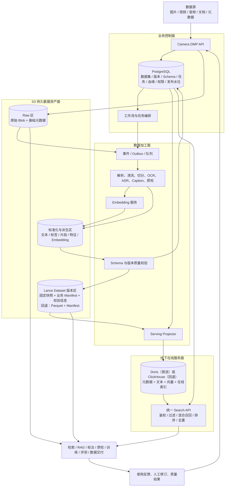

# Camera DMP 底层数据架构重构方案建议书（初版）

> 文档定位：Camera DMP 底层数据流转、资产管理与在线检索架构重构建议  
> 参考方向：火山引擎 LAS 的数据加工分工与 ByteHouse 的在线多模态检索设计  
> 方案边界：优先明确数据如何接入、加工、版本化、发布、检索、反馈与重建；暂不展开字段级模型、索引参数和部署规格  
> 编制日期：2026-08-13

## 1. 执行摘要

Camera DMP 已具备数据接入、检索、标注、质检、工作流和交付等能力，PostgreSQL、ClickHouse、对象存储、RabbitMQ、Celery、Milvus 及外部 AI 计算平台各自承担了一部分职责。随着数据规模和业务类型增加，原始文件、业务版本、加工结果、元数据和向量索引分散管理的问题逐渐显现：同一份数据在不同系统中的状态难以核对，数据版本难以准确复现，发布和回滚也缺少清晰边界。

本次重构借鉴 LAS 与 ByteHouse 的职责划分，重点吸收数据加工、资产管理和在线检索分层的做法，不复刻其闭源实现：

- **S3 作为持久数据事实层**：保存原始多模态文件，也保存标准化样本、解析结果、标注、特征、Embedding、Manifest 等版本化派生资产；
- **PostgreSQL 作为业务控制面**：管理租户、权限、数据集、数据版本、Schema、任务、血缘、审批、发布状态和索引水位；
- **数据加工层承担多模态理解**：完成解析、清洗、切分、OCR、ASR、Caption、质量评估和 Embedding，不把这些职责交给在线数据库；
- **Doris 或 ClickHouse 作为在线服务投影**：在线保存可检索元数据、文本和向量，建立索引并执行结构化、全文和向量混合检索；其中 Doris 为 ByteHouse 替代方向的优先验证对象，ClickHouse 使用同一工作负载建立正式基准和回退能力；
- **在线数据库不是唯一数据事实**：数据库中的数据和索引必须能够从 S3 上已发布的固定数据版本重新构建；
- **以发布协议连接资产层与服务层**：只有通过质量校验、生成不可变 Manifest 并完成在线投影的数据版本，才对业务可见。

整体分工是：S3 保存原始数据和派生数据，PostgreSQL 管理业务状态与版本，计算任务生成可复现的数据集，Doris/ClickHouse 承担在线检索。数据库中的数据和索引均可由 S3 上的已发布版本重建。

本次重构优先解决以下问题：

1. 原始数据与加工结果边界不清；
2. 路径被当作数据身份，跨版本和跨系统关联不稳定；
3. 数据版本只存在于业务记录中，无法精确复现其实际内容；
4. 元数据、文本和向量分别写入多个系统，发布状态与检索可见性不一致；
5. 在线索引一旦损坏或更换数据库，缺少统一重建来源。

## 2. 设计目标与范围

### 2.1 设计目标

- 建立覆盖图片、视频、音频、文档及其衍生文本、标签和向量的统一数据流；
- 使每一份已发布数据集都具备稳定身份、固定内容、明确 Schema、完整血缘和可重建能力；
- 将 S3 云端持久存储与线下数据库、缓存和计算资源清晰解耦；
- 使 Doris 与 ClickHouse 遵循同一投影契约，数据库选型变化不影响上层数据资产模型；
- 支持批量导入、增量更新、重新加工、模型升级、删除传播和版本回滚；
- 为检索、训练、评测、标注、质检和数据交付提供一致的数据版本入口；
- 在不一次性推翻现有业务系统的前提下分阶段迁移。

### 2.2 初版范围

本方案覆盖：

- 数据接入与登记；
- 多模态解析和加工；
- Raw、标准化资产与 DatasetVersion 的组织；
- 数据版本发布及在线投影；
- 结构化、全文和向量混合检索；
- 数据消费、反馈回流和版本再生产；
- 一致性、重放、重建、回滚和删除；
- Doris/ClickHouse 的职责与选择建议；
- 分阶段落地建议。

以下内容留待后续专题设计：

- 每张表、每个字段和完整 Schema；
- 索引类型、分区、排序键、向量维度和参数；
- 服务器数量、CPU、内存、磁盘和网络规格；
- API 请求响应结构及完整检索 DSL；
- 详细容量估算、压测脚本与生产运维手册。

## 3. 参考设计及可借鉴边界

### 3.1 LAS + ByteHouse 案例中的职责划分

火山引擎企业级 RAG 案例的主链路可归纳为：

```text
PDF 原始文件存入 TOS
        ↓
LAS / Daft 调用 PDFParse 解析文本和图片
        ↓
LAS 算子进行文本切分和多模态 Embedding
        ↓
ClickhouseWriter 将文件引用、模态、内容和向量写入 ByteHouse
        ↓
ByteHouse 建立并维护在线索引
        ↓
查询向量化
        ↓
ByteHouse 执行结构化过滤 + 向量 Top-K
        ↓
文本片段或图片路径返回上层 RAG 应用
```

从这条链路可以看出各层的职责：

- 对象存储保存原始内容；
- 数据加工平台负责理解和转换多模态数据；
- 在线数据库接收加工后的标准化记录，而不是直接理解 S3 中的原始文件；
- 在线数据库维护自己的检索数据和索引；
- 上层应用通过统一检索服务取得片段、文件引用和相关属性。

### 3.2 本方案的开源替代映射

| 火山引擎参考角色 | Camera DMP 建议角色 | 说明 |
|---|---|---|
| TOS | 现有 S3/OBS/MinIO 兼容对象存储 | 保存原始 Blob 与持久化派生资产 |
| LAS 数据资产与任务控制 | PostgreSQL + DatasetVersion 管理 + 工作流 | 管理数据、任务、版本、血缘与发布 |
| Daft/Ray 多模态加工 | 现有 Celery/Polars/PyArrow/GPU 作业，后续可演进分布式计算 | 解析、清洗、切分、特征生成与批量处理 |
| Lance 数据组织 | S3 上的 Lance 格式与 SDK | 保存版本化标准样本和派生资产；PoC 不通过时回退到 Parquet + Manifest |
| ByteHouse 在线服务 | 首选 Apache Doris，回退 ClickHouse | 保存在线投影并执行混合检索 |
| ByteHouseWriter | Camera DMP Projector | 按固定版本将数据幂等投影到在线数据库 |
| 在线查询入口 | Search API / Search Gateway | 权限、查询编排、融合、去重和结果封装 |

ByteHouse 的闭源文件格式、分布式缓存和执行引擎优化不在本次复现范围内，Doris 和 ClickHouse 也不能视为 ByteHouse 的等价实现。本方案借鉴的是三项架构做法：数据加工与在线检索分开建设；不同模态转换为统一的检索记录；在线服务数据可以从持久化资产重新生成。

ByteHouse 通过分布式 SSD 缓存和计算侧文件系统降低远程读取开销。S3 与线下服务器组合部署不具备这些现成能力，网络带宽、远程小文件访问、本地 SSD 缓存、缓存失效以及 S3 故障时的处理方式均需单独设计和验证。

## 4. 目标架构

### 4.1 四个平面

目标架构划分为四个平面。

| 平面 | 主要组件 | 核心职责 | 是否为持久事实 |
|---|---|---|---|
| 业务控制面 | PostgreSQL、API、权限、工作流 | 数据集、版本、Schema、任务、血缘、审批、发布与水位 | 是，业务事实 |
| 数据资产面 | S3 Raw 区、标准化区、Lance Dataset 版本区 | 原始文件、派生内容、固定版本、Manifest 与交换文件；Parquet + Manifest 作为回退 | 是，数据事实 |
| 数据加工面 | RabbitMQ/Celery、CPU/GPU Worker、外部 AI 平台 | 解析、清洗、切分、标注、质检、Embedding 和批处理 | 否，执行过程可重试 |
| 在线服务面 | Doris 或 ClickHouse、Search API、缓存 | 在线过滤、全文、向量、融合、聚合与结果返回 | 否，可重建投影 |

### 4.2 总体逻辑架构



图中有两类数据消费路径：

- Search API 面向低延迟检索、筛选、浏览和 RAG 召回；
- 固定 DatasetVersion 面向训练、评测、批量加工和数据交付，避免通过在线搜索结果临时拼装训练数据。

## 5. 面向领导的端到端数据流程图

### 5.1 主数据链路

```text
图片、视频、音频、文档及业务元数据进入 Camera DMP
                            ↓
原始文件写入 S3 Raw 区，PostgreSQL 登记稳定资产 ID、来源和接入任务
                            ↓
事件触发数据加工任务
                            ↓
解析、清洗、去重，并按模态生成统一检索单元
（图片 / 文档块 / 视频片段与关键帧 / 音频片段）
                            ↓
生成 OCR、ASR、Caption、标签、质量结果和多模态 Embedding
                            ↓
标准化样本及派生结果写回 S3，形成可追溯的数据资产
                            ↓
通过 Schema、完整性、关联关系和质量校验
                            ↓
冻结 DatasetVersion，生成不可变 Manifest 和处理血缘
                            ↓
Projector 将该固定版本的元数据、文本和向量写入线下 Doris / ClickHouse
                            ↓
Doris / ClickHouse 建立并维护结构化、全文和向量在线索引
                            ↓
用户查询或图片经过同版本模型向量化
                            ↓
在线数据库执行权限范围内的结构化过滤 + 全文召回 + 向量 Top-K + 融合排序
                            ↓
Search API 返回稳定资产 ID、片段内容、S3 文件引用和版本信息
                            ↓
供检索、RAG、标注、质检、训练选数、评测和数据交付使用
                            ↓
人工修订、质量反馈和模型结果回流，生成新的派生数据与 DatasetVersion
```

### 5.2 流程约束

1. 原始文件始终保留在 S3，不因数据库部署在线下而迁移其长期存储位置；
2. 文本、标签和向量先作为版本化派生资产保存，再发布到在线数据库；
3. 在线数据库维护自己的索引，不直接在外部原始文件上“原地建索引”；
4. 发布单位是固定 DatasetVersion，不是若干相互独立的表写入动作；
5. 检索返回稳定 ID 和 S3 引用，路径只是位置，不是数据身份；
6. 反馈不会直接覆盖已发布版本，而是形成新的加工结果和版本。

## 6. 数据分层与存储边界

### 6.1 S3 持久数据资产层

S3 在逻辑上划分为三个区域，物理隔离可以采用 Bucket、前缀或独立账号。

#### Raw 区

保存数据进入平台时的原始状态：

- 图片、视频、音频、PDF、办公文档、压缩包；
- 外部 JSON、Parquet、清单和采集侧元数据；
- 来源、采集时间、内容 Hash、接入批次等基础信息；
- 必要的合规、保留和隔离标签。

Raw 数据原则上只追加、不覆盖。文件位置变化不改变 `asset_id`；内容变化形成新的不可变修订。

#### 标准化与派生区

保存由加工任务生成、可被复用的中间和最终结果：

- 文档解析文本、页面图片和布局信息；
- 图片 Caption、OCR、标签和质量分；
- 视频关键帧、镜头、时间片段、字幕和音轨引用；
- 音频 ASR、说话人片段和时间戳；
- 数据清洗、去重、标注、质检和增强结果；
- Dense/Sparse Embedding 及模型版本；
- 任务中间清单、失败清单和校验结果。

派生资产以稳定 ID、输入版本、处理 Pipeline、模型版本和参数共同标识，允许跨数据集版本复用，避免重复计算。

#### Dataset 版本区

保存可交付、可训练、可评测和可重建的固定数据版本：

- 标准化样本及其多模态关系；
- 版本固定的元数据、文本、标签、质量结果和 Embedding；
- Schema 与字段语义版本；
- Manifest、父版本、处理血缘、模型与参数；
- 行数、文件数、校验和、质量统计和异常摘要；
- 各在线投影的目标版本与构建水位。

本方案建议引入 Lance 格式与 SDK，作为 S3 上版本化 Dataset 的优先实现。Lance 用于组织标准化样本、多模态关系、文本、标签、质量结果和 Embedding，并利用快照、Fragment 复用和 Schema 演进能力降低自研版本管理的复杂度。

引入范围限定如下：

- 暂不部署 LanceDB Server，在线检索仍由 Doris/ClickHouse 承担；
- 图片、视频、音频、PDF 和压缩包等原始大文件继续作为普通对象保存在 S3，Lance 中保存稳定 ID、S3 URI、内容 Hash 和标准化属性；
- 文本、标签、质量结果、时间范围、多模态关系和 Embedding 等列式数据可以直接保存在 Lance；
- Lance 不替代 PostgreSQL 中的权限、任务、审批、血缘和发布状态；
- 若 PoC 未通过，则回退到 Parquet + 受控 Manifest，稳定 ID、DatasetVersion、Projector 和发布协议保持不变。

### 6.2 Lance 与业务版本的关系

Lance 内部版本和 Camera DMP 的 DatasetVersion 分别处理物理快照与业务发布，两者不能直接画等号。

```text
DatasetVersion V2
├── parent_version：V1
├── lance_uri：s3://camera-dmp/datasets/night-road/data.lance
├── lance_version：18
├── schema_version：road-image-v3
├── pipeline_run：run-20260813-001
└── projection：Doris/ClickHouse 投影状态
```

构建 V2 时可以发生多次 Lance 内部提交，例如分批写入、补写失败数据和 Compaction；V2 最终只绑定经过校验的 Lance Version 18。中间提交属于构建过程，不直接对业务发布。

新增数据时，旧数据不移动也不复制。假设 V1 包含 A、B、C，V2 增加 D、E，Lance 可以复用旧 Fragment：

```text
Lance Version 17（对应 DatasetVersion V1）
└── Fragment 1：A、B、C

Lance Version 18（对应 DatasetVersion V2）
├── Fragment 1：A、B、C
└── Fragment 2：D、E
```

平台仍保留一份业务发布 Manifest，用于记录父版本、Lance 快照、Schema、Pipeline、模型、质量统计和在线投影。Lance 内部 Manifest 由 Lance SDK 管理 Fragment、列和事务快照，Camera DMP 不重复实现这部分能力。

业务发布 Manifest 可采用以下形式：

```json
{
  "dataset_id": "night-road",
  "version_id": "v2",
  "parent_version_ids": ["v1"],
  "data_snapshot": {
    "format": "lance",
    "uri": "s3://camera-dmp/datasets/night-road/data.lance",
    "lance_version": 18
  },
  "schema_version": "road-image-v3",
  "row_count": 100200,
  "pipeline_run_id": "run-20260813-001",
  "models": {
    "caption": "caption-model-1.5",
    "embedding": "clip-model-2.1"
  },
  "projection_targets": [
    {
      "engine": "doris",
      "projection_id": "projection-108",
      "status": "READY"
    }
  ]
}
```

为避免大量小 Fragment，接入数据先按数量、大小或时间窗口形成批次，再由受控的 Dataset Writer 提交。多个 Worker 可以并行生成分片，但同一 Dataset 的提交应由单一协调者管理。生产环境还需固定经过验证的 Lance SDK 和文件格式版本，并设置 Compaction、版本保留和垃圾回收策略。

### 6.3 PostgreSQL 业务控制面

PostgreSQL 不保存大规模文件内容和大规模向量，主要保存：

- App、用户、团队、权限、审批与安全分级；
- Dataset 与 DatasetVersion 的业务身份；
- 版本状态、父子关系、当前发布指针和回滚指针；
- 数据资产、修订、片段和派生结果的登记信息；
- Schema、字段定义、单位、命名空间和兼容策略；
- 加工任务、输入版本、输出版本、Pipeline 和模型版本；
- Outbox 事件、Projector 任务、索引水位和失败状态；
- 数据保留、删除、审计和使用记录。

PostgreSQL 是业务状态的权威来源，但不是大规模成员明细和在线检索数据的主要承载者。

### 6.4 线下 Doris/ClickHouse 在线服务层

线下数据库允许保存：

- 稳定资产与片段 ID；
- App、DatasetVersion、权限范围等在线过滤字段；
- 文件类型、时间、设备、地域、质量等高频结构化属性；
- Caption、OCR、ASR、标签、文件名等可检索文本；
- Dense/Sparse Embedding 及模型标识；
- S3 URI、预览引用和必要的结果展示信息；
- 数据实体版本、删除标记和投影水位。

线下数据库不应成为以下内容的唯一保存位置：

- 原始多模态文件；
- 已发布数据集的唯一成员清单；
- 唯一一份 OCR、ASR、Caption 或 Embedding；
- 唯一的数据版本和处理血缘；
- 无法从 S3 版本资产恢复的业务事实。

在线服务数据可进一步按热度管理：当前发布版本和高频版本保留在线索引，低频历史版本按需保留或卸载；卸载不等于删除，仍可从 S3 固定版本重新投影。返回 S3 内容时由服务端进行权限复核并签发短时访问地址，不向调用方暴露长期凭据或不受控路径。

## 7. 统一多模态数据组织

### 7.1 统一身份层次

数据对象按以下层次组织，本阶段不展开完整字段设计：

```text
Asset                逻辑数据资产，如一个 PDF、一段视频或一张图片
  └─ AssetRevision   该资产某次不可变内容修订
       └─ Segment    可独立加工、检索和引用的单元
            └─ Derivative / Embedding
                     某次 Pipeline 或模型产生的文本、标签、特征与向量

Dataset
  └─ DatasetVersion  一组固定 AssetRevision / Segment 及其版本属性
```

典型映射如下：

| 模态 | Asset | Segment 示例 | 可检索派生内容 |
|---|---|---|---|
| 图片 | 原始图片 | 整图、检测框、裁剪区域 | OCR、Caption、标签、视觉向量 |
| 视频 | 原始视频 | 镜头、时间片段、关键帧 | ASR、Caption、事件标签、片段向量 |
| 音频 | 原始音频 | 时间片段、说话人片段 | ASR、说话人、音频向量 |
| 文档 | PDF/Office 文档 | 页面、段落、表格、图片 | 正文、版面、摘要、文本/图像向量 |
| 组合样本 | 业务逻辑样本 | 输入、参考、输出等角色成员 | Prompt、标注、评分、多模态关系 |

### 7.2 统一检索记录

所有在线引擎接收同一类逻辑检索记录：

```text
SearchDocument
├─ 稳定身份：asset_id / revision_id / segment_id
├─ 业务范围：app / dataset / dataset_version / permission_scope
├─ 模态关系：media_type / segment_type / parent / role
├─ 内容引用：S3 URI / preview reference
├─ 可检索文本：title / caption / OCR / ASR / tags / business text
├─ 结构化属性：时间 / 设备 / 地域 / 质量 / 状态 / 来源
├─ 向量：embedding + model/version/dimension
└─ 投影控制：entity_version / is_deleted / published_version
```

高频过滤字段应受 Schema 管理并进入正式列；长尾属性可以保留在 JSON、VARIANT 或 Map 类型中，但不得无限制扩张为无语义约束的 KV 集合。

### 7.3 Schema 与多模态关系

- 核心字段具有统一名称、类型、单位和含义；
- 来源特有字段进入命名空间，避免同名覆盖；
- 一个样本包含多张图片、文本和标签时，应显式记录角色关系；
- 视频片段、关键帧、ASR 和 Caption 必须携带父资产与时间范围；
- Embedding 必须绑定 Segment、模型版本、维度和归一化方式；
- Pipeline 或模型升级不覆盖旧结果，而是生成新的派生版本；
- Schema 不兼容变更形成新 SchemaVersion，并通过转换任务迁移。

## 8. 数据生命周期与关键流程

### 8.1 接入与登记

1. 调用方提交文件或外部 S3 引用及基础元数据；
2. 原始对象写入 Raw 区，计算内容 Hash；
3. PostgreSQL 分配稳定资产 ID，记录来源、租户和接入批次；
4. 同一事务中写入业务状态与 Outbox 事件；
5. 事件投递到队列，启动异步解析；
6. 重复事件以资产 ID、修订 ID 和任务版本幂等处理。

对象存储事件可以作为触发信号，但不能作为唯一业务事实。平台应通过 Outbox、扫描对账或受控接入 API 保证“文件已存在”和“业务已登记”最终一致。

### 8.2 多模态加工

1. Worker 按模态选择解析 Pipeline；
2. 读取 Raw 对象，生成标准化 Segment；
3. 执行清洗、去重、格式转换和基础质量校验；
4. 调用 OCR、ASR、Caption、检测、质量模型等服务；
5. Embedding 服务按指定模型批量生成向量；
6. 结果写入 S3 派生区，并登记输入、输出、模型与参数；
7. 失败任务保留检查点，可按分片重试而不重做全部数据。

Celery 可以继续承担第一阶段的任务编排，但应逐步从“全局串行防冲突”改为“按数据版本和分片并行 + 幂等写入 + 乐观水位控制”。当批处理规模超过 Celery/单机 Polars 的稳定边界时，再引入 Ray、Spark 或其他分布式计算，不将其作为初版前置条件。

### 8.3 DatasetVersion 构建与发布

版本状态如下：

```text
DRAFT → BUILDING → VALIDATING → READY → PUBLISHING → PUBLISHED
               └→ FAILED          └──────────────→ FAILED
PUBLISHED → DEPRECATED → DELETING → DELETED
```

发布步骤：

1. 创建版本时固定输入 DatasetVersion、SchemaVersion、Pipeline 和模型版本；
2. 构建过程中写入标准化资产和成员关系；
3. 校验文件可读性、稳定 ID、Schema、多模态关系、向量维度和成员数量；
4. 生成不可变 Manifest，并冻结 S3 数据版本；
5. 版本进入 `READY`，生成目标在线投影任务；
6. Projector 将该版本幂等写入 Doris/ClickHouse；
7. 数据库索引达到目标水位后执行抽样对账和查询验收；
8. PostgreSQL 原子切换当前发布指针，版本进入 `PUBLISHED`；
9. Search API 只查询已发布水位的数据。

任何内容、标签、质量结果或 Embedding 变化都创建新版本或新的派生结果，不原地修改已发布版本。回滚通过切换发布指针完成。

### 8.4 在线检索

```text
查询请求
  ↓
身份认证、App/DatasetVersion 与权限范围解析
  ↓
文本或图片查询向量化
  ↓
结构化条件编译
  ↓
全文候选 + 向量候选 + 必要的结构化预过滤
  ↓
RRF 或经验证的融合排序
  ↓
按稳定 ID 去重、权限复核与分页
  ↓
返回 Segment 内容、Asset 信息、S3 引用与数据版本
```

Search API 对上层屏蔽 Doris 与 ClickHouse 的 SQL 差异，并统一：

- 结构化过滤；
- 关键词/全文检索；
- 文本搜图、以图搜图及后续跨模态检索；
- 数据集版本和权限范围；
- 召回融合、去重和稳定分页；
- 查询向量模型选择；
- 结果中的稳定 ID、版本和内容引用。

查询规则以版本化的“检索策略”管理，其中包括结构化、全文和向量各路的候选深度，预过滤或后过滤方式，RRF 或加权融合、跨模态权重、重排以及片段向资产聚合规则。引擎能力和检索策略由此可以分别评估，“混合检索”也不再被简化为某一个固定算子。

### 8.5 反馈与再生产

搜索点击、人工标注、质检结果、模型误差和业务使用结果应回写为新的事实记录，并绑定原始 Segment 与已使用的数据版本。反馈经审核后可以触发：

- 标签或质量结果修订；
- 新模型重新生成 Caption/Embedding；
- 困难样本集或评测集构建；
- 数据清洗规则优化；
- 新 DatasetVersion 发布。

反馈闭环不直接修改旧版本，从而保持训练、评测和历史查询的可解释性。

### 8.6 删除与保留

删除分为三个阶段：

1. **撤销可见性**：控制面将资产或版本标记为不可用，Search API 不再返回；
2. **传播墓碑**：Projector 将删除标记写入在线数据库并确认水位；
3. **物理回收**：满足保留期、血缘引用和审计要求后，回收数据库数据、派生文件和原始 Blob。

任何仍被有效 DatasetVersion、训练记录、交付记录或合规保留策略引用的数据不得直接物理删除。

## 9. 事实层、投影层与一致性

### 9.1 权威来源

| 信息 | 权威来源 |
|---|---|
| 用户、权限、版本状态、发布指针 | PostgreSQL |
| 原始多模态内容 | S3 Raw 区 |
| 已冻结标准化样本和派生数据版本 | S3 Dataset 版本区 |
| 在线过滤、全文、向量索引 | Doris/ClickHouse 投影 |
| 任务运行日志与指标 | 日志和监控系统 |

同一信息可以存在多个副本；表中“权威来源”是指发生冲突或执行重建时采用的依据。

### 9.2 发布一致性

不采用跨 PostgreSQL、S3 和数据库的分布式事务，而采用版本状态机、幂等投影和水位提交：

```text
冻结 S3 版本
  → 写入发布事件
  → Projector 幂等构建在线投影
  → 记录数据库水位
  → 对账与验收
  → 原子切换发布指针
```

在发布指针切换前，新版本即使部分数据已经进入数据库，也不能被普通查询看到。可采用 `published_version`、别名、逻辑视图或版本过滤实现这一可见性边界。

### 9.3 Projector 契约

Projector 是资产层到在线服务层的唯一标准写入通道，应具备：

- 以 DatasetVersion 和分片为输入；
- 读取固定 Manifest，不读取动态 `latest`；
- 按 `segment_id + entity_version` 幂等写入；
- 保护乱序事件，旧版本不得覆盖新版本；
- 记录读取、写入、失败、跳过和删除数量；
- 支持断点续写、死信、重放和限速；
- 输出索引水位与校验摘要；
- 同一输入可投影到 Doris 或 ClickHouse；
- 支持按 App、DatasetVersion 或时间范围重建。

每次投影应形成独立的 Projection 记录，至少标识来源数据版本、目标引擎、目标 Schema、索引配置版本、构建状态、预期与实际数量、校验摘要和最后水位。索引本身也应区分待构建、构建中、可用、过期和失败，避免“数据写入成功”被误判为“已经可检索”。

### 9.4 对账与重建

平台应持续执行三类对账：

- 控制面对 S3：版本记录、Manifest、成员数量和对象存在性；
- S3 对在线数据库：版本水位、行数、删除数、抽样 Hash 和向量模型；
- 在线数据库对 Search API：权限、过滤、全文、向量和结果引用可用性。

在线数据库损坏、迁移或索引策略变化时，重建流程为：

```text
选择已发布 DatasetVersion
  ↓
读取其固定 Manifest 与 S3 版本资产
  ↓
创建新的在线投影命名空间
  ↓
全量导入并构建索引
  ↓
追平发布期间增量
  ↓
对账与查询验收
  ↓
切换 Search API 指针
```

完成上述重建能力后，更换或升级 Doris、ClickHouse 不再依赖旧数据库保留的历史状态。

## 10. Doris 与 ClickHouse 的定位建议

### 10.1 选择原则

数据库选择只决定在线投影和检索执行方式，不改变 S3、PostgreSQL、DatasetVersion 和 Projector 的总体设计。评估维度应包括：

- 结构化过滤、全文、向量检索能否在一个执行计划中协同；
- 过滤选择率变化时的召回率与延迟；
- 持续写入、更新、删除和索引构建的稳定性；
- 冷启动、缓存预热和 S3/远程存储访问成本；
- 单机或少量线下服务器上的部署和恢复难度；
- 1,000 万至 1 亿检索单元的容量和资源成本；
- 索引失败、节点故障和版本升级时的重建能力；
- 现有 ClickHouse 数据和查询的迁移工作量。

### 10.2 推荐结论

#### 优先验证：Apache Doris

Doris 的能力方向与本方案所需的结构化过滤、全文检索、向量检索和 SQL 编排较为接近，也有机会减少 ClickHouse 与独立向量库之间的一致性维护和查询编排，因此列为优先验证对象。

Doris 4.0 已提供面向定长向量的 ANN 索引、倒排全文能力和结构化预过滤，但这些能力不能直接等同于 ByteHouse：向量列和距离度量存在约束；“结构化/文本条件预过滤后执行 ANN”也不等于 BM25 排名与向量排名已经原生融合。真正的双路相关性融合仍需 SQL RRF、Search API 融合或后续重排，并以实际版本官方约束为准。

该判断只确定验证顺序，不构成生产迁移结论。PoC 需要使用接近实际规模的数据验证：

- 向量索引和全文索引能否稳定共存；
- 结构化预过滤下的 Recall、P95/P99；
- 持续导入、Compaction、删除和重建；
- 冷启动、磁盘占用和线下服务器内存压力；
- 多租户并发和热点数据隔离；
- 版本升级及故障恢复。

#### 同基准验证与回退：ClickHouse

现有平台已经使用 ClickHouse，元数据过滤、聚合和运维经验可以继续复用，迁移成本也相对较低。它主要适用于：

- Doris PoC 未通过时的低风险回退；
- 新资产层和发布协议建设期间的过渡服务；
- 结构化过滤和聚合为主、向量融合要求相对有限的场景。

ClickHouse 向量相似度索引已在 25.8 达到 GA，原生文本索引在 26.2 达到生产可用，因此它应使用与 Doris 完全相同的数据版本、过滤矩阵和混合查询集建立正式基准，而不是只作为旧系统兼容性对照。其主要风险仍是全文、过滤 ANN 和相关性融合语义与 ByteHouse 并不等价，需要以目标版本实测，不能因为两者同源就默认具备相同能力。

#### 最后回退：ClickHouse + 集中式向量服务

仅当 Doris 和 ClickHouse 单引擎向量能力无法同时满足 Recall、延迟或容量目标时，再保留集中式 Milvus/Qdrant。此时仍应：

- 停止新增按数据集拆分的 Milvus Lite 文件；
- 由统一 Projector 同时投影两个在线系统；
- 以稳定 ID 和版本水位对齐；
- 由 Search API 负责候选融合；
- 保持两个投影均可从 S3 数据版本重建。

## 11. 与当前架构相比的主要变化

| 当前方式 | 目标方式 | 直接收益 |
|---|---|---|
| 原始文件在 S3，派生结果散落在任务和数据库 | 原始与派生资产均在 S3 形成受控分层 | 加工结果可复用、可追溯、可重建 |
| 路径承担文件身份和去重 | 稳定 Asset/Revision/Segment ID + 内容 Hash | 支持重命名、迁移、跨版本复用 |
| 每 App 一张 ClickHouse 表 | 统一逻辑检索模型，按租户字段和资源策略隔离 | 降低 DDL、Schema 和动态 SQL 成本 |
| 多个 Milvus Lite 文件逐库查询 | 单引擎向量检索或集中式向量服务 | 全局 Top-K、统一监控与备份 |
| 数据版本依赖 PG、CH、S3、Milvus 临时对齐 | 固定 S3 版本 + Manifest + 在线投影水位 | 发布、回滚和恢复边界清晰 |
| 写完一个系统即可能被查询 | 完成投影、对账后原子发布 | 避免半发布和越权可见 |
| 模型升级覆盖或重新散写 | 派生结果绑定 Pipeline/模型版本 | 支持复现、对比和回退 |
| 数据库是事实和索引的混合体 | 数据库明确为可重建 Serving Projection | 降低迁移和故障恢复风险 |

现有平台中的 PostgreSQL、对象存储、RabbitMQ、Celery、权限、审批、工作流、标注和质检能力可以继续复用。重构重点是重新定义这些组件之间的数据协议和状态边界，而不是一次性替换全部技术栈。

## 12. 分阶段落地建议

### 阶段 0：建立事实基线与统一身份

本阶段先理清数据身份、存储位置和版本归属。

- 盘点 S3、PostgreSQL、ClickHouse 和 Milvus Lite 的现有数据关系；
- 引入稳定 Asset、Revision、Segment ID 和内容 Hash；
- 停止以路径作为唯一身份和去重依据；
- 建立最小 Schema 注册与多模态关系规则；
- 明确 Raw、派生资产和在线投影的目录与保留策略。

### 阶段 1：建立版本化数据资产层

选取一批代表性数据，形成首个能够从原始数据重新加工、冻结和读取的 DatasetVersion。

- 选取代表性图片、视频和文档数据集；
- 打通 Raw → 解析/切分 → 派生资产 → 固定 DatasetVersion；
- 生成 Manifest、Schema Hash、成员数量和处理血缘；
- 引入 Lance 格式与 SDK，验证 S3 兼容性、增删改、快照读取、Fragment 复用、并发提交、Compaction、版本清理和批量读取；
- 固定 Lance SDK 与文件格式版本，不引入 LanceDB Server；
- 如验证未通过，以 Parquet + 受控 Manifest 过渡；
- 固定任务输入输出版本，禁止读取动态 `latest`。

### 阶段 2：建立发布协议与统一 Projector

通过统一投影程序和发布协议，使在线数据库能够从固定数据版本重建。

- 建立 PostgreSQL Outbox、版本状态机和索引水位；
- 实现 DatasetVersion → ClickHouse 的首个 Projector；
- 建立幂等、乱序保护、断点续写、死信和重放；
- 建立版本对账与从 S3 全量重建能力；
- 将历史 Milvus Lite 数据回收到统一版本资产。

### 阶段 3：Doris 与 ClickHouse 对照 PoC

两种引擎使用相同的数据版本、投影规则和查询集进行测试。

- Doris 4.x 作为优先验证候选；
- ClickHouse 26.2+ 使用同等数据规模和查询集建立正式基准；
- 使用真实模态比例、过滤选择率、向量维度和并发；
- 验证过滤、全文、ANN、混合融合、写入、删除、冷启动和重建；
- 以功能、质量、性能、运维四类决策门选择引擎。

### 阶段 4：迁移在线检索与统一入口

完成历史数据迁移和增量追平后切换生产检索，原始数据和业务控制面保持不变。

- 上线统一 Search API；
- 历史版本全量投影，新数据双写或事件追平；
- 完成权限、结果、行数、Recall 和延迟对账；
- 短暂停写后切换发布和查询指针；
- 保留旧投影一段观察期，支持快速回滚；
- 稳定后停止新增 App 独立表和 Milvus Lite 文件。

### 阶段 5：完善反馈闭环与平台化治理

将检索、标注、质检、训练和评测结果纳入后续数据版本生产。

- 回流检索点击、标注、质检、训练和评测结果；
- 构建困难样本、评测集和模型对比版本；
- 完善成本、质量、新鲜度和血缘监控；
- 根据规模决定是否引入分布式加工引擎和多节点高可用。

## 13. PoC 与验收框架

PoC 验收分为四类。

### Gate A：数据正确性

- 稳定 ID、版本成员和多模态关系正确；
- 文件、文本、标签、向量和模型版本可追溯；
- 权限过滤无跨 App 或跨数据集泄漏；
- 重复事件、乱序事件和任务重试不产生错误结果；
- 删除和回滚结果符合版本语义。

### Gate B：检索质量

- 结构化过滤结果与精确基线一致；
- ANN Recall@K 达到业务目标；
- 混合检索不低于关键词或向量任一单路基线；
- 图片、视频片段、音频片段和文档块均有代表性测试集；
- 不同过滤选择率下分别测量召回率。

### Gate C：性能与容量

- 1,000 万、5,000 万和 1 亿检索单元分级验证；
- 报告数据量、向量维度、过滤选择率、并发和冷热状态；
- 验证导入、增量更新、索引构建、查询和删除吞吐；
- 验证 S3 访问、线下网络、缓存预热和本地磁盘压力；
- 延迟目标根据现网业务基线最终确定。

### Gate D：运维与恢复

- 单节点或服务故障后可恢复；
- 可从固定 DatasetVersion 重建在线投影；
- 支持版本升级、备份、监控、限流和容量告警；
- 连续混合读写和 Compaction 无不可恢复错误；
- 运维复杂度符合现有线下服务器和团队能力。

## 14. 主要风险与控制建议

| 风险 | 表现 | 控制建议 |
|---|---|---|
| S3 与线下网络成为瓶颈 | 加工或重建时远程小文件读取慢 | 批量文件、顺序读取、本地受控缓存、带宽与故障演练 |
| 派生资产造成存储放大 | 多模型、多版本重复保存文本和向量 | 内容 Hash、派生结果复用、版本保留与垃圾回收 |
| Lance 引入运维成本 | 小 Fragment、并发提交、格式升级和版本清理复杂 | 批量写入、单一提交协调者、固定版本、Compaction、PoC 后再扩大范围 |
| Doris 新检索能力稳定性不足 | ANN、全文、Compaction 或冷启动未达标 | 真实负载 PoC，ClickHouse 保持回退能力 |
| ClickHouse 无法达到混合检索质量 | 关键词相关性或融合能力不足 | Search API 补充融合，必要时集中式向量服务 |
| Celery 串行任务吞吐不足 | 大批量导入积压 | 分片并行、幂等写入、检查点；达到阈值后引入分布式计算 |
| Schema 再次失控 | 长尾 JSON 字段不断增长 | Schema 注册、高频字段晋升、兼容性校验和命名空间 |
| 半发布数据被查询 | 多系统写入进度不同 | 固定版本、投影水位、发布前对账、原子切换指针 |
| 删除不完整 | 数据库已删但 S3 或旧版本仍保留 | 引用检查、墓碑传播、保留期和分阶段物理回收 |

## 15. 方案结论

本次改造不从数据库替换入手，先建设稳定 ID、S3 数据分层、不可变 DatasetVersion、Manifest、Projector 和发布水位。完成这些基础工作后，在线引擎才能在不影响数据资产模型的情况下进行比较和替换。

原始 Blob 长期保留在 S3，文本、标签、片段和向量等派生结果也以开放格式形成可复现版本。PostgreSQL 继续管理业务状态、版本和权限；Doris/ClickHouse 在线保存元数据、文本、向量及索引，并能够从 S3 固定版本重建。

版本化 Dataset 优先采用 Lance 格式与 SDK。原始大文件仍以普通 S3 对象保存，Lance 负责组织标准化样本、文件引用、文本、标签、质量结果和 Embedding。Camera DMP 的 DatasetVersion 绑定经过校验的 Lance 快照，并继续使用业务 Manifest 记录父版本、处理过程和投影状态。第一阶段不部署 LanceDB Server；PoC 不通过时回退到 Parquet + Manifest。

多模态解析、切分、OCR、ASR、Caption、质检和 Embedding 在数据加工层完成，在线数据库接收标准化检索记录。DatasetVersion 完成冻结、质量校验、在线投影、索引构建和对账后方可发布。

Doris 作为优先验证对象，ClickHouse 使用同等数据和查询集建立基准并保留回退能力。最终选型依据真实多模态数据下的过滤正确性、Recall、P99、持续写入、资源占用和恢复表现确定。

PostgreSQL、RabbitMQ、Celery、对象存储、权限、工作流、标注和质检能力在初期继续复用。改造工作围绕数据协议和状态边界逐步展开，不要求一次性替换现有技术栈。

## 16. 后续需要深化的专题

- DatasetVersion、Asset、Revision、Segment、Derivative 的详细领域模型；
- S3 目录、对象命名、Manifest 与数据保留规范；
- Lance on S3 PoC 及 Parquet 过渡方案；
- Projector、Outbox、索引水位和发布状态机详细设计；
- 多模态 Pipeline、模型版本和派生结果复用设计；
- Search API、混合检索策略与权限过滤设计；
- Doris/ClickHouse 等比 PoC 数据集、查询集和验收阈值；
- 历史 ClickHouse 与 Milvus Lite 数据迁移和回滚方案；
- 线下服务器与 S3 之间的带宽、缓存、容灾和安全设计。

## 17. 参考依据

### 本地架构与方案材料

- `Camera DMP数据网格平台设计剖析与架构归档.md`
- `Camera DMP混合检索三路线重构落地方案书.md`
- `数据平台重构中Lance的价值与引入建议.md`
- `数据集版本管理设计.md`
- `Agent数据平台值得借鉴的设计分析报告.md`
- `Q&A/数据平台问答归档.md`
- `research/ByteHouse_中文版.md`
- `research/Camera_DMP_Doris_vs_ClickHouse_重构选型归档.md`
- `research/bytehouse_figures_archive/ByteHouse_Figures_Archive.md`

### 外部参考方向

- [火山引擎 LAS 企业级 RAG 案例](https://docs.volcengine.com/docs/6492/1799580?lang=zh)
- [ByteHouse 云原生实时多模态分析与检索论文](https://arxiv.org/abs/2602.08226)
- [Apache Doris Vector Index](https://doris.apache.org/docs/dev/key-features/vector-index/)
- [Apache Doris Full-text Search](https://doris.apache.org/docs/dev/key-features/full-text-search/)
- [Apache Doris Hybrid Search](https://doris.apache.org/zh-CN/docs/dev/key-features/hybrid-search/)
- [Apache Doris Reciprocal Rank Fusion](https://doris.apache.org/docs/4.x/key-features/reciprocal-rank-fusion/)
- [Apache Doris 4.0 Release](https://doris.apache.org/releases/v4.0/release-4.0.0/)
- [ClickHouse Exact and Approximate Vector Search](https://clickhouse.com/docs/reference/engines/table-engines/mergetree-family/annindexes)
- [ClickHouse Full-text Search with Text Indexes](https://clickhouse.com/docs/reference/engines/table-engines/mergetree-family/textindexes)
- [ClickHouse 26.2 Release](https://clickhouse.com/blog/clickhouse-release-26-02)
- [Lance Table Format and Manifest](https://lance.org/format/table/)
- [Lance Object Store Configuration](https://lance.org/guide/object_store/)
- [Lance Format Versioning](https://lance.org/format/file/versioning/)
- [Lance Transactions](https://lance.org/format/table/transaction/)
