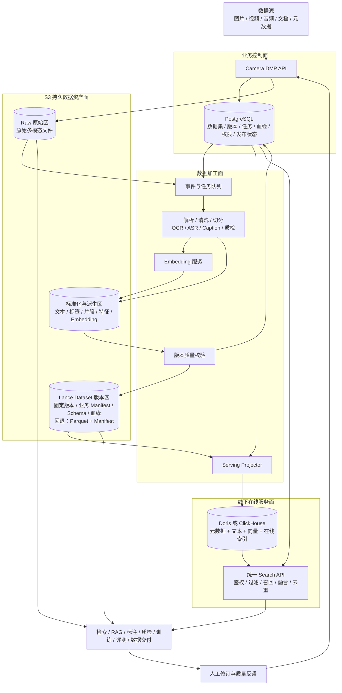

# Camera DMP 底层数据架构重构方案建议书（简化版）

> 文档定位：用于方案沟通与快速评审  
> 参考方向：火山引擎 LAS 的数据加工分工与 ByteHouse 的在线多模态检索设计  
> 编制日期：2026-08-13

## 1. 方案结论

Camera DMP 已具备数据接入、对象存储、元数据检索、向量检索、标注、质检和工作流等能力。随着数据规模和处理环节增加，原始文件、加工结果、数据版本和在线索引分散管理的问题开始影响追溯、发布、回滚和故障恢复。本次重构的重点是理顺这些数据之间的关系。

底层架构按四个平面划分：

1. **S3 数据资产面**：保存原始多模态文件，以及文本、标签、片段、质量结果、Embedding 和数据集版本等派生资产；
2. **PostgreSQL 业务控制面**：管理数据集、版本、任务、Schema、血缘、权限、审批和发布状态；
3. **数据加工面**：完成解析、清洗、切分、OCR、ASR、Caption、质检和 Embedding；
4. **在线服务面**：使用 Doris 或 ClickHouse 保存可检索投影，提供结构化、全文和向量检索。

整体分工是：S3 保存可长期追溯的数据，PostgreSQL 管理业务状态，计算任务生成固定的数据版本，Doris/ClickHouse 提供在线检索。数据库中的元数据、文本、向量和索引均可从 S3 上的固定版本重建。原始文件继续保存在 S3，不因数据库部署在线下服务器而迁移。

版本化 Dataset 优先采用 Lance 格式与 SDK。Lance 用于组织标准化样本、文本、标签、质量结果、Embedding 和文件引用；原始大文件仍作为普通对象保存在 S3。第一阶段不部署 LanceDB Server，PoC 不通过时回退到 Parquet + Manifest。

## 2. 为什么需要重构

当前平台的主要问题包括：

- 文件路径同时承担定位、身份和去重职责，文件移动或重命名会影响跨系统关联；
- 原始文件、业务版本、元数据和向量分散在 PostgreSQL、S3、ClickHouse 和 Milvus Lite 中；
- 一个数据集版本依赖多个系统临时保持一致，缺少统一的发布动作；
- 每个 App 独立 ClickHouse 表、多个 Milvus Lite 文件增加了 Schema、查询和运维成本；
- OCR、ASR、Caption、标签和 Embedding 等加工结果缺少统一的版本化保存方式；
- 在线数据库或索引损坏后，缺少明确、完整的重建来源；
- 数据库选型被放在数据流和资产管理之前，容易出现更换数据库但底层问题仍然存在的情况。

因此，本次重构应先解决数据身份、分层、版本、发布和重建，再通过 PoC 决定 Doris 或 ClickHouse。

## 3. 目标架构

### 3.1 总体架构图



### 3.2 各层职责

| 层次 | 保存或处理的内容 | 核心定位 |
|---|---|---|
| PostgreSQL | 数据集、版本、Schema、任务、血缘、权限、审批、发布水位 | 业务控制面 |
| S3 Raw 区 | 图片、视频、音频、文档、压缩包和外部清单 | 原始数据事实 |
| S3 派生与版本区 | Lance 优先保存文本、标签、片段、质量结果、Embedding、固定版本和业务 Manifest；Parquet + Manifest 作为回退 | 派生数据事实 |
| 加工任务 | 解析、清洗、切分、OCR、ASR、Caption、质检和向量化 | 多模态数据生产 |
| Doris/ClickHouse | 在线元数据、文本、向量和索引 | 可重建服务投影 |
| Search API | 权限过滤、查询向量化、混合召回、融合、去重和结果封装 | 统一检索入口 |

## 4. 端到端数据流程图

```text
图片、视频、音频、文档及业务元数据进入 Camera DMP
                            ↓
原始文件写入 S3 Raw 区，PostgreSQL 登记稳定资产 ID、来源和接入任务
                            ↓
事件触发数据加工任务
                            ↓
解析、清洗、去重，并按模态生成统一检索单元
（图片 / 文档块 / 视频片段与关键帧 / 音频片段）
                            ↓
生成 OCR、ASR、Caption、标签、质量结果和多模态 Embedding
                            ↓
标准化样本及派生结果写回 S3，形成可追溯的数据资产
                            ↓
通过 Schema、完整性、关联关系和质量校验
                            ↓
冻结 DatasetVersion，生成不可变 Manifest 和处理血缘
                            ↓
Projector 将固定版本的元数据、文本和向量写入线下 Doris / ClickHouse
                            ↓
Doris / ClickHouse 建立并维护结构化、全文和向量在线索引
                            ↓
用户文本或图片查询经过同版本模型向量化
                            ↓
在线数据库执行权限范围内的结构化过滤 + 全文召回 + 向量 Top-K + 融合排序
                            ↓
Search API 返回稳定资产 ID、片段内容、S3 文件引用和版本信息
                            ↓
供检索、RAG、标注、质检、训练选数、评测和数据交付使用
                            ↓
人工修订、质量反馈和模型结果回流，生成新的 DatasetVersion
```

流程需满足以下约束：

- 原始文件始终保留在 S3；
- 多模态理解和 Embedding 在数据加工层完成；
- 派生结果先形成可追溯的数据资产，再发布到在线数据库；
- 在线数据库维护自己的索引，但不是唯一数据来源；
- 发布单位是固定 DatasetVersion，而不是若干独立数据库写入；
- 检索返回稳定 ID 和受权限控制的 S3 引用；
- 修改和反馈形成新版本，不覆盖已经发布的历史版本。

## 5. 多模态数据如何统一管理

图片、视频、音频和文档按同一套数据层次管理：

```text
Asset                 一个逻辑数据资产
  └─ AssetRevision    该资产某次不可变内容修订
       └─ Segment     可独立加工和检索的片段
            └─ Derivative / Embedding
                      文本、标签、特征和向量

Dataset
  └─ DatasetVersion   一组固定资产或片段及其版本属性
```

| 模态 | Asset 示例 | Segment 示例 | 派生结果示例 |
|---|---|---|---|
| 图片 | 原始图片 | 整图、检测框、裁剪区域 | OCR、Caption、标签、视觉向量 |
| 视频 | 原始视频 | 镜头、时间片段、关键帧 | ASR、事件标签、片段向量 |
| 音频 | 原始音频 | 时间片段、说话人片段 | ASR、说话人、音频向量 |
| 文档 | PDF、Office 文档 | 页面、段落、表格、图片 | 正文、布局、摘要、文本或图像向量 |

文件路径只负责定位，不再承担数据身份。Embedding 必须绑定具体 Segment、模型版本、维度和预处理方式；模型升级产生新的派生结果，不覆盖旧向量。

## 6. 数据版本与发布机制

### 6.1 DatasetVersion

一个可发布的数据版本至少应能够说明：

- 包含哪些固定资产和片段；
- 使用什么 Schema；
- 来源于哪个上游版本；
- 经过哪些处理任务；
- 使用什么模型和参数；
- 数据量、文件数、校验和及质量结果；
- 已经投影到哪个在线数据库和索引版本。

版本状态如下：

```text
DRAFT → BUILDING → VALIDATING → READY → PUBLISHING → PUBLISHED
               └→ FAILED          └──────────────→ FAILED
PUBLISHED → DEPRECATED → DELETING → DELETED
```

### 6.2 发布流程

```text
固定输入数据版本
  ↓
完成加工并写入 S3 版本资产
  ↓
生成 Manifest 与校验结果
  ↓
Projector 幂等构建在线投影和索引
  ↓
记录投影水位并执行对账
  ↓
原子切换当前发布版本
```

只有完成投影、索引构建和对账的数据版本才能被普通查询看到。回滚只需要将发布指针切回旧版本，不修改旧数据。

### 6.3 重建流程

```text
选择已发布 DatasetVersion
  ↓
读取固定 Manifest 与 S3 版本资产
  ↓
重新投影元数据、文本和向量
  ↓
构建数据库索引
  ↓
完成数据与查询对账
  ↓
切换在线服务指针
```

通过该机制，Doris 或 ClickHouse 可以替换、升级或重新部署，而不丢失数据版本事实。

### 6.4 Lance 的使用方式

Lance 只承担 S3 上版本化 Dataset 的组织，不替代 PostgreSQL 和 Doris/ClickHouse：

```text
S3 Raw
保存图片、视频、音频、PDF 等原始文件

Lance Dataset
保存文件引用、标准化样本、文本、标签、质量结果和 Embedding

PostgreSQL
管理 DatasetVersion、权限、任务、血缘和发布状态

Doris / ClickHouse
保存已发布版本的在线检索投影
```

新增数据时不复制旧文件。假设 V1 包含 A、B、C，V2 增加 D、E：

```text
Lance Version 17（DatasetVersion V1）
└── Fragment 1：A、B、C

Lance Version 18（DatasetVersion V2）
├── Fragment 1：A、B、C
└── Fragment 2：D、E
```

Camera DMP 的业务版本只绑定最终校验通过的 Lance 快照：

```text
DatasetVersion V2
→ s3://camera-dmp/datasets/night-road/data.lance
→ Lance Version 18
```

一次业务版本构建可以包含多次 Lance 内部提交，中间提交不对业务发布。平台仍需保留业务 Manifest，记录父版本、Lance 快照、Schema、Pipeline、模型和在线投影状态。

引入边界如下：

- 采用 Lance 格式与 SDK，不部署 LanceDB Server；
- 原始大文件不默认写入 Lance；
- 同一 Dataset 采用批量写入和受控提交，避免大量小 Fragment；
- 固定经过验证的 Lance SDK 和文件格式版本；
- PoC 验证 S3 兼容性、增删改、快照读取、Fragment 复用、Compaction 和版本清理；
- 验证不通过时回退到 Parquet + 受控 Manifest。

## 7. Doris 与 ClickHouse 选型建议

数据库选型只决定在线服务层如何实现，不应改变 S3、PostgreSQL、DatasetVersion 和 Projector 的设计。

### 7.1 Doris

Doris 的能力方向较接近本方案所需的结构化过滤、全文和向量单引擎检索，也有机会减少 ClickHouse 与独立向量库之间的一致性维护和查询编排，因此列为优先验证对象。

Doris 不能直接视为 ByteHouse 的等价替代。结构化或文本预过滤后执行 ANN，与 BM25 排名和向量排名的融合是两件事；后者仍需 SQL RRF、Search API 或重排服务完成。向量索引、持续写入、Compaction、冷启动和恢复能力都要用真实数据验证。

### 7.2 ClickHouse

ClickHouse 具有现有平台经验、迁移成本低和元数据分析能力成熟等优势。其向量相似度索引已在 25.8 达到 GA，原生文本索引在 26.2 达到生产可用，因此应与 Doris 使用相同数据规模、查询集和过滤矩阵建立正式基准，而不只是作为旧系统兼容性对照。

### 7.3 建议顺序

1. 使用 Doris 4.x 进行优先验证；
2. 使用 ClickHouse 26.2+ 建立同等条件基准；
3. 根据检索质量、延迟、持续写入、资源成本和恢复能力选择；
4. 只有单引擎向量能力不能满足要求时，再考虑 ClickHouse + 集中式 Milvus/Qdrant；
5. 停止继续增加按数据集拆分的 Milvus Lite 文件。

## 8. 分阶段落地路线

| 阶段 | 主要工作 | 阶段成果 |
|---|---|---|
| 阶段 0：统一身份 | 盘点数据关系，引入稳定 Asset/Revision/Segment ID 和内容 Hash | 路径不再承担数据身份 |
| 阶段 1：资产版本化 | 建立 Raw、派生资产和 DatasetVersion，引入并验证 Lance 格式与 SDK，保留 Parquet + Manifest 回退 | 数据版本可复现 |
| 阶段 2：发布协议 | 建立 Outbox、Projector、索引水位、对账和重建 | 在线数据库成为可重建投影 |
| 阶段 3：引擎 PoC | Doris 4.x 与 ClickHouse 26.2+ 同条件测试 | 形成可量化选型结论 |
| 阶段 4：迁移检索 | 历史回填、增量追平、影子查询、统一 Search API 和切换回滚 | 完成生产检索迁移 |
| 阶段 5：反馈闭环 | 回流标注、质检、训练和评测结果 | 持续生成新数据版本 |

第一阶段不需要立即引入新的分布式计算平台。现有 RabbitMQ、Celery、Polars、PyArrow 和 GPU 作业可以继续使用，并通过分片、幂等、检查点和水位控制改善吞吐。当处理规模超过现有能力边界时，再评估 Ray、Spark 等分布式计算引擎。

## 9. PoC 重点

PoC 不只比较数据库是否具备某项功能，而应验证完整数据链路。

### 数据与发布

- 固定版本能否从 S3 正确投影；
- 重复、乱序和失败重试是否保持幂等；
- 投影、索引和发布水位是否一致；
- 是否能够从 S3 完整重建在线数据。

### 检索质量

- 结构化条件结果是否完全正确；
- ANN Recall@K 是否达到目标；
- 混合检索是否优于关键词或向量任一单路；
- 不同过滤选择率下的召回率和延迟；
- 图片、视频、音频和文档是否均有代表性测试。

### 性能与运维

- 1,000 万至 1 亿检索单元的容量；
- 持续导入、索引构建、删除和 Compaction；
- 冷启动、缓存预热、线下磁盘和内存占用；
- S3 与线下服务器之间的带宽、远程读取和故障影响；
- 节点故障、版本升级、备份和恢复。

## 10. 主要风险

| 风险 | 控制建议 |
|---|---|
| S3 与线下网络成为瓶颈 | 批量顺序读取、本地受控缓存、带宽测试和故障演练 |
| 派生数据造成存储放大 | 内容 Hash、跨版本复用、保留策略和垃圾回收 |
| Lance 引入额外维护成本 | 批量写入、受控提交、固定格式版本，并验证 S3、Fragment、Compaction 和版本清理 |
| Doris 检索能力未达到生产要求 | 与 ClickHouse 同条件实测并保留回退能力 |
| ClickHouse 混合相关性不足 | Search API 融合或集中式向量服务作为后续方案 |
| Celery 串行任务吞吐不足 | 按版本和分片并行、幂等写入和断点续写 |
| 多系统出现半发布 | 固定版本、投影水位、发布前对账和原子切换 |
| 权限或删除传播不完整 | 在线预过滤、短时 S3 地址、墓碑和分阶段物理回收 |

## 11. 方案结论

本次改造先建设稳定 ID、S3 数据分层、DatasetVersion、Manifest 和发布协议。原始文件及版本化派生资产保存在 S3；PostgreSQL 继续管理业务、权限、版本、任务和血缘；多模态解析和向量化由数据加工层完成。

版本化 Dataset 优先采用 Lance 格式与 SDK。原始大文件继续作为普通 S3 对象保存，Lance 组织标准化数据、文件引用和 Embedding；Camera DMP 业务版本绑定最终校验通过的 Lance 快照。第一阶段不部署 LanceDB Server，验证不通过时回退到 Parquet + Manifest。

Doris/ClickHouse 保存可从固定数据版本重建的在线投影。Doris 优先验证，ClickHouse 使用同等条件建立正式基准。Projector、索引水位和原子发布共同控制版本可见性，避免未完成的数据提前进入查询。

现有基础设施在迁移期间继续使用，各项改造按阶段推进，不要求一次性替换整个平台。

## 12. 参考材料

- [详细版方案](Camera%20DMP底层数据架构重构方案建议书_初版.md)
- [火山引擎 LAS 企业级 RAG 案例](https://docs.volcengine.com/docs/6492/1799580?lang=zh)
- [ByteHouse 云原生实时多模态分析与检索论文](https://arxiv.org/abs/2602.08226)
- [Apache Doris Vector Index](https://doris.apache.org/docs/dev/key-features/vector-index/)
- [Apache Doris Hybrid Search](https://doris.apache.org/zh-CN/docs/dev/key-features/hybrid-search/)
- [ClickHouse Vector Search](https://clickhouse.com/docs/reference/engines/table-engines/mergetree-family/annindexes)
- [ClickHouse Text Index](https://clickhouse.com/docs/reference/engines/table-engines/mergetree-family/textindexes)
- [Lance Table Format](https://lance.org/format/table/)
