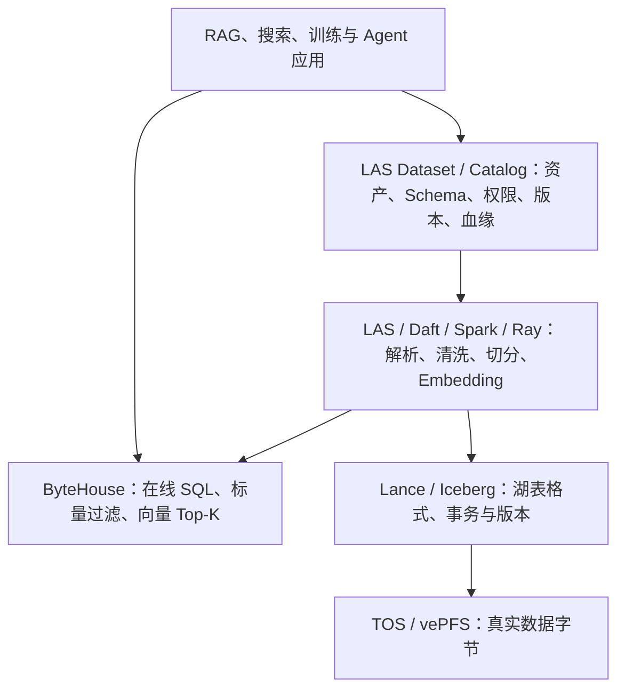
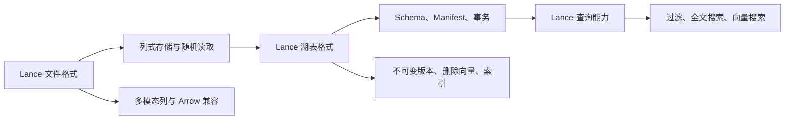
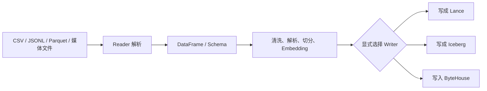
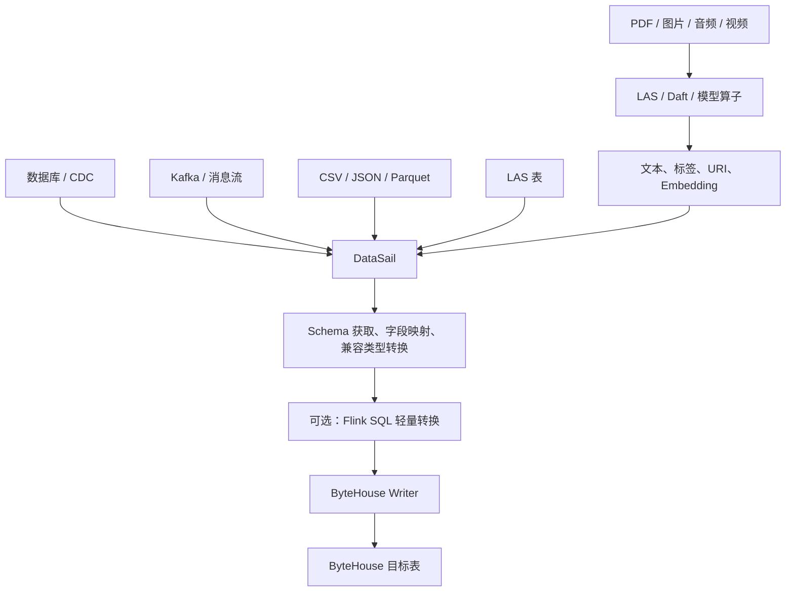
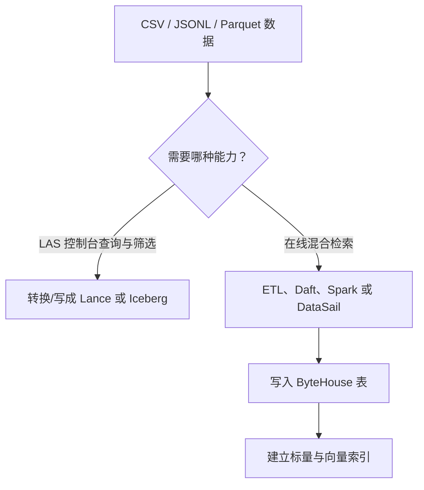
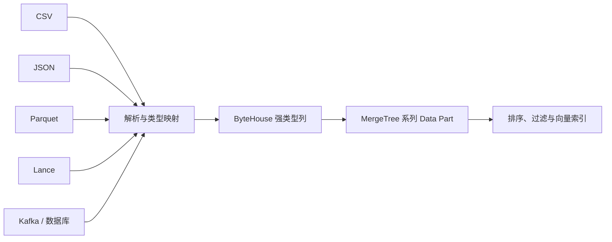
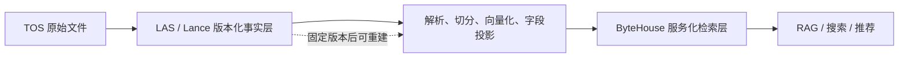
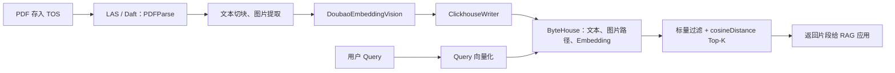
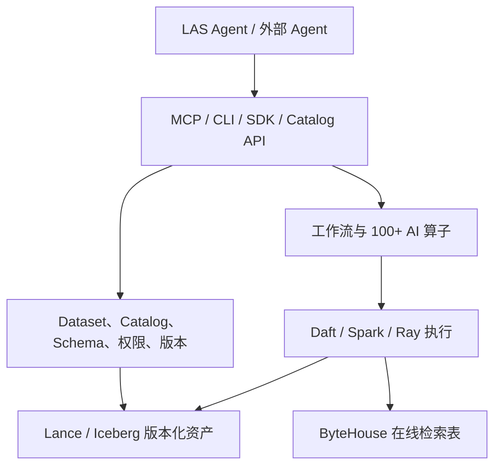

# LAS、Lance、LanceDB、DataSail 与 ByteHouse：示例讲解版

> 用途：通过具体业务例子理解 LAS、Lance、LanceDB、DataSail、ByteHouse 与 Agent 的关系。  
> 详细论证参见《LAS、Lance、LanceDB 与 ByteHouse 问题及调研结论》。

本文中的公司、数据集名称和样例数据均为说明性示例；产品能力判断仍以文末官方资料为依据。

## 一页结论

| 组件 | 一句话定位 | 不应误解为 |
|---|---|---|
| LAS | 管理多模态数据资产、处理任务、算子、Catalog 和版本的平台 | 单一数据库 |
| Lance | 面向 AI/多模态数据的列式文件格式和湖表格式，同时具备版本、过滤及向量检索能力 | 只有文件编码、不能查询 |
| LanceDB | 构建在 Lance 之上的完整数据库/湖仓产品与生态 | Lance 格式的同义词 |
| Iceberg | 通用分析型湖表格式，提供快照、事务和多引擎访问 | ByteHouse 内部格式 |
| DataSail | 多源异构数据的连接、字段映射、类型转换和批流同步工具 | PDF 解析或 Embedding 引擎 |
| ByteHouse | 面向在线 SQL、分析、标量过滤和向量混合检索的数据库 | 只能读取 Lance 的检索引擎 |
| TOS/vePFS | 保存原始文件、媒体和湖表真实数据字节的存储层 | 仅保存 LAS 元数据 |

最重要的判断：

> LAS/Lance 更像可版本化的数据事实与生产层；ByteHouse 更像面向线上查询的服务化检索层；DataSail 是数据搬运与同步层。



---

## 1. Lance 在 LAS 中到底是什么？

Lance 在 LAS 中同时覆盖多个层次，而不只是“文件格式”。



### Lance 与 LanceDB 的边界

```text
Lance    = 数据文件 + 湖表语义 + SDK/查询能力
LanceDB  = 基于 Lance 构建的完整数据库/湖仓产品
```

可以确认 LAS 深度使用了 Lance 格式及相关 SDK、Spark Catalog 和 REST Catalog 生态；但公开资料不足以证明 LAS 默认部署了完整 LanceDB 产品作为内部数据库。

### 例子：商品图片质量数据集

假设电商团队在 LAS 中维护一个 `product_image_quality` 数据集，每行包含：

| product_id | image_uri | category | quality_score | embedding |
|---|---|---|---:|---|
| 10001 | `tos://ai-data/shoes/10001.jpg` | shoes | 0.92 | `[0.12, -0.07, ...]` |
| 10002 | `tos://ai-data/shoes/10002.jpg` | shoes | 0.41 | `[0.03, 0.18, ...]` |

如果该数据集采用 Lance：

1. 图片路径、品类、质量分和向量可以作为同一张表的不同列管理。
2. 质检模型运行后，可以给数据集增加 `quality_score` 列，而不必重新制作一套 CSV 清单。
3. 删除低质量样本或修正标签时，会产生新的数据集版本，旧版本仍可用于复现实验。
4. 可以针对 `category = 'shoes' AND quality_score > 0.8` 做过滤，也可以根据 `embedding` 查找相似图片。

这里真正落地的是 **Lance 格式及其表能力**。如果团队另外部署 LanceDB，并通过 LanceDB 的连接、Catalog 和查询 API 管理这些表，才更接近“使用完整 LanceDB 产品”。仅看到 `.lance` 文件或 `LanceCatalog`，不能直接推断 LAS 的全部查询服务都由 LanceDB 提供。

---

## 2. LAS 会不会自动把所有数据转成 Lance？

不会。必须区分三个阶段：



1. **注册数据集**：LAS 记录数据位置、格式和管理信息，通常不重写源文件。
2. **Reader 读取**：不同格式在任务运行时被解析成统一 DataFrame/Schema；源文件仍未改变。
3. **Writer 写出**：用户显式选择 Lance、Iceberg、Parquet 或 ByteHouse，才发生物理写入和格式转换。

因此，“统一成 DataFrame”不等于“自动转换成 Lance”。

### 例子：把客户评价 CSV 加工成 Lance 数据集

用户先把下面的文件上传到 TOS：

```text
tos://customer-data/raw/reviews.csv
```

文件内容：

```csv
review_id,product_id,text,rating
1,10001,"鞋底很舒服",5
2,10002,"包装破损",2
```

随后在 LAS 控制台创建 CSV 数据集 `raw_reviews`。这一步通常只表示：

- LAS 知道数据集名称是 `raw_reviews`；
- 数据在上述 TOS 路径；
- 应按照 CSV 规则读取；
- LAS 并没有因此自动生成 `.lance` 文件。

运行任务时，CSV Reader 把文件解析成 DataFrame：

```text
review_id: Int64
product_id: Int64
text: String
rating: Int64
```

团队再执行去空值、语言检测、情感分类和 Embedding，得到新列：

```text
language、sentiment、embedding
```

最后显式执行 `write_las_dataset(format="Lance")`，生成 `review_features_v1`。只有最后一步才真正把处理结果写成 Lance。

如果最终目标是在线客服检索，也可以不先写 Lance，而是把处理后的 DataFrame 直接写入 ByteHouse。是否保存一份 Lance 版本，取决于团队是否需要训练复现、版本管理和后续重算。

---

## 3. DataSail 在数据进入 ByteHouse 时做什么？

DataSail 是连接和同步工具，核心职责是把已经能够结构化表达的数据可靠地搬到目标端。



DataSail 可以完成：

- Source/Target Connector；
- Schema 获取和字段映射；
- 兼容类型转换；
- 离线全量、实时增量和 CDC；
- 字段拆分、过滤、Cast 等轻量 Flink SQL 转换；
- 在部分条件下自动创建 ByteHouse 目标表。

DataSail 通常不负责：

- PDF 深度解析和 OCR；
- 图片、音频、视频语义理解；
- 文本切块策略；
- Embedding 模型推理；
- ByteHouse 向量索引和线上查询策略设计。

### 例子 A：MySQL 订单表同步到 ByteHouse

源端 MySQL 表：

```sql
orders(
  order_id BIGINT,
  user_id BIGINT,
  amount DECIMAL(18,2),
  status VARCHAR(32),
  updated_at DATETIME
)
```

DataSail 可以完成：

1. 通过 MySQL Reader 读取全量订单。
2. 获取字段 Schema，并把 MySQL 类型映射到 ByteHouse 类型。
3. 把 `status` 改名为 `order_status`，或过滤测试订单。
4. 通过 ByteHouse Writer 写入目标表。
5. 继续读取 MySQL Binlog，把后续新增、更新和删除同步过去。

此时 DataSail 解决的是“订单数据如何稳定搬过去”，并不需要 AI 模型参与。

### 例子 B：PDF 知识库不能只依靠 DataSail

假设输入是 `refund_policy.pdf`。DataSail 可以搬运文件路径或二进制内容，但它不会仅靠字段映射自动理解“退款期限是 7 天”。正确链路通常是：

```text
PDF → LAS/Daft PDFParse → 文本切块 → Embedding
    → 形成 document_id、chunk_id、content、embedding 等字段
    → DataSail 或 Writer → ByteHouse
```

换句话说，先把非结构化内容加工成结构化记录，再由 DataSail 负责传输，职责边界最清晰。

---

## 4. LAS“搜索筛选”和 ByteHouse“混合检索”是一回事吗？

不是同一种产品能力，也不能从公开资料推断由同一个引擎执行。

| 对比项 | LAS 数据集搜索筛选 | ByteHouse 混合检索 |
|---|---|---|
| 目标 | 数据探查、预览、字段筛选、全文搜索 | 在线低延迟标量过滤 + 向量 Top-K |
| 典型数据 | Lance/Iceberg 湖表 | ByteHouse 内表 |
| 执行环境 | LAS 数据集服务、Catalog 与湖表查询能力 | ByteHouse SQL 和向量索引 |
| 是否要求写入 ByteHouse | 没有公开证据表明需要 | 是，检索字段通常已写入 ByteHouse 表 |



为什么 LAS 控制台主要对 Lance/Iceberg 开放高级查询？因为它们具备稳定 Schema、Manifest/Snapshot、事务、版本和维护语义。普通 CSV、JSONL、Parquet 文件集没有同等完整的湖表语义。

### 例子：同一批售后文档的两种“搜索”

团队有 10 万条售后问答，原始数据是 `faq.jsonl`。

**场景一：数据工程师在 LAS 中探查数据**

数据工程师希望找到：

```text
category = "退款" 且 quality_score < 0.6 的样本
```

目的是检查低质量训练数据、修改标签或重新加工。若团队希望直接在 LAS 数据集页面稳定翻页、过滤和管理版本，可以把 JSONL 加工成 Lance 或 Iceberg 数据集。这里是**湖内数据探查**。

**场景二：客服机器人在线回答用户**

用户输入：“鞋子穿了三天还能退吗？”系统需要在几十毫秒到数百毫秒内完成：

```text
tenant_id = 2001
category = "退款"
向量相似度 Top-K
```

这类请求通常把问答文本、标签和 Embedding 写入 ByteHouse，再由 ByteHouse 执行标量过滤加向量检索。这里是**线上混合检索**。

两者都可以叫“搜索”，但服务对象、数据位置和性能目标完全不同。

---

## 5. ByteHouse 是否只支持 Lance 数据？

不是。ByteHouse 关心的是数据写入后的目标表 Schema，而不是上游最初是什么文件格式。



ByteHouse 中可以同时存在：

- `UInt64`、`Float32`、`String`、`DateTime` 等标量；
- `Array`、`Map` 等复合类型；
- 文本内容和媒体 URI；
- 通常以 `Array(Float32)` 表达的 Embedding；
- HNSW、IVF 等向量索引。

数据写入后，目标列的真实字节由 ByteHouse 持久化为自己的 Data Part，而不是继续以原始 CSV、Parquet 或 Lance 文件形态保存在内表中。

大型 PDF、图片和视频通常仍保存在 TOS；ByteHouse 保存其 URI、解析文本、元数据和向量。只有显式写入二进制列时，ByteHouse 才会再保存一份媒体字节。

### 例子：三个不同来源写入同一张 ByteHouse 检索表

假设 ByteHouse 目标表为：

```sql
knowledge_chunks(
  document_id String,
  source_type LowCardinality(String),
  source_uri String,
  category String,
  content String,
  embedding Array(Float32),
  updated_at DateTime
)
```

它可以同时接收：

1. 从 CSV 导入的 FAQ：`source_type = 'csv_faq'`；
2. 从 Parquet 导入的历史工单：`source_type = 'parquet_ticket'`；
3. 从 Lance 数据集读取的产品说明：`source_type = 'lance_manual'`。

无论上游来源是什么，写入后都会变成 ByteHouse 表中的 `String`、`DateTime` 和 `Array(Float32)` 等列，并由 ByteHouse 的 MergeTree 系列表保存。查询者不会要求“这条记录原来是不是 Lance”。

例如用户查询：

```sql
SELECT document_id, content
FROM knowledge_chunks
WHERE category = '退款'
ORDER BY cosineDistance(embedding, :query_vector)
LIMIT 5;
```

这条查询可以同时命中来自 CSV、Parquet 和 Lance 的记录。

---

## 6. 为什么既要 LAS 数据层，又要 ByteHouse 数据层？

两层是不同用途的数据副本，而不是无意义重复。



| LAS/Lance 数据资产层 | ByteHouse 服务化检索层 |
|---|---|
| 保存高保真原始数据和多模态资产 | 保存面向线上查询的字段投影 |
| 版本、回滚、血缘、训练复现 | 高并发 SQL、聚合和向量 Top-K |
| 面向批处理、重新解析和模型重算 | 面向稳定低延迟查询模式 |
| 对象存储适合大规模冷数据 | 为索引和服务性能付出更多成本 |

为了可重建和追溯，ByteHouse 检索表建议保留：

```text
dataset_id、dataset_version、source_uri、document_id、chunk_id
content、metadata、embedding、embedding_model、pipeline_version
```

### 例子：产品手册为什么会在两层各保存一部分数据？

公司有一份 200 页的 `camera_manual_v5.pdf`：

**在 TOS/LAS/Lance 层保存：**

- 原始 PDF；
- 每页图片和版面信息；
- 完整解析结果；
- 数据集版本 `v5`；
- OCR、清洗和人工修订结果；
- 训练时使用的标签和历史版本。

**在 ByteHouse 层保存：**

- `document_id = camera_manual_v5`；
- `chunk_id = page_37_chunk_2`；
- 文本片段“相机过热时自动进入保护模式……”；
- 产品型号、语言、章节等过滤字段；
- 当前线上 Embedding；
- 指向原始 PDF 页面的 TOS URI。

一年后更换 Embedding 模型时，团队可以从 LAS 中固定的 `v5` 数据重新切块和计算向量，再构建一张新的 ByteHouse 表。原始 PDF 和完整历史版本不必全部塞入 ByteHouse，线上表也不必永久承担事实档案的职责。

---

## 7. LAS + ByteHouse 官方 RAG 链路



这条官方案例清楚说明：

- LAS/Daft 负责解析、加工和向量化；
- ByteHouse 负责写入后的表存储、索引和在线检索；
- ByteHouse 不是直接在外部 Lance 文件上建立 ANN 索引；
- 中间结果不必先写成 Lance 才能进入 ByteHouse。

### 例子：用户询问“公司的退款期限是多少？”

假设 `refund_policy.pdf` 已上传至 TOS。

**离线准备阶段：**

1. `PDFParse` 解析 PDF，提取标题、正文和图片。
2. 切块算子得到以下记录：

   ```text
   document_id: refund_policy_2026
   chunk_id: section_3_chunk_1
   content: 商品签收后 7 个自然日内可以申请无理由退货……
   category: 退款
   ```

3. Embedding 算子把 `content` 转换成向量。
4. Writer 把 `document_id`、`chunk_id`、`content`、`category`、`embedding` 和原始 PDF 路径写入 ByteHouse。

**在线查询阶段：**

1. 用户问：“收到货以后几天内能退？”
2. 系统把问题转换成查询向量。
3. ByteHouse 先过滤 `category = '退款'`，再按向量距离排序。
4. 最相关记录是“签收后 7 个自然日内……”。
5. RAG 应用把这段内容和原始文档链接交给大模型生成答案。

该例子中，LAS 并没有承担在线 Top-K 查询；ByteHouse 也没有负责解析 PDF。两边各自处理最擅长的部分。

---

## 8. LAS 为什么比较 Agent-friendly？

LAS 的 Agent-friendly 特征来自多层组合，而不只是数据库格式。



Agent-friendly 的关键条件：

1. 数据具有稳定的数据集 ID、Schema 和 Catalog 入口；
2. Agent 可以先探查数据，再选择 Reader、算子和 Writer；
3. Lance/Iceberg 提供可固定、可追溯的数据版本；
4. MCP、CLI、SDK 和算子把底层能力包装成机器可调用工具；
5. 工作流、权限和资源系统限制 Agent 的执行范围。

当前更准确的定位是：

> LAS 已具备明显的 **Agent-ready 数据平台**特征；公开资料尚不足以证明它已经是完整的 **Agent-native 数据基础设施**。

仍需官方确认的部分包括：完整 MCP 工具清单和权限粒度、Agent 是否自动固定完整数据与模型版本、危险写操作的人机审批，以及 LAS 到 ByteHouse 的内置增量同步和索引维护能力。

### 例子：让 Agent 清洗一批商品图片

用户向 LAS Agent 提出：

> 找出数据集 `product_images_v3` 中模糊或重复的图片，保留鞋类商品，生成一个新的训练数据集，不要覆盖原数据。

一个 Agent-friendly 平台应允许 Agent 按以下步骤工作：

1. 通过 Dataset/Catalog 查到 `product_images_v3` 的 Schema、格式、版本和权限。
2. 抽样读取少量记录，确认包含 `product_id`、`category`、`image_uri` 等字段。
3. 选择图片清晰度检测、图片 Hash/去重和字段过滤算子。
4. 生成 Daft/Spark/Ray Pipeline，并先进行小规模试运行。
5. 用户确认结果后，正式执行任务。
6. 把结果写成新的 Lance 数据集 `product_images_v4_clean`，记录输入版本、算子参数和输出版本。

如果没有 Dataset、Catalog 和算子接口，Agent 就必须猜测 TOS 路径、图片字段、读取库、并发方式和输出目录；不仅 Prompt 更长，也更容易误删或覆盖数据。

这也说明 LAS 的 Agent-friendly 主要来自：

```text
可发现的数据资产 + 有版本的数据底座 + 可调用的算子
+ 可执行的工作流 + 权限与资源边界
```

而不是因为底层用了某一种数据库格式，就自然解决了全部 Agent 接入问题。

---

## 常见误区速查

| 误解 | 更准确的说法 |
|---|---|
| Lance 只是一种存储格式 | Lance 还提供湖表、版本、事务、过滤和向量检索能力 |
| LAS 使用 Lance 就等于部署了完整 LanceDB | 可以确认深度使用 Lance/LanceDB 生态，但无法确认完整 LanceDB 产品部署形态 |
| LAS 所有搜索都由 ByteHouse 执行 | LAS 数据集搜索与 ByteHouse 在线混合检索是不同能力 |
| ByteHouse 只支持 Lance 数据 | CSV、JSON、Parquet、Kafka、数据库等均可经解析和映射后写入 |
| LAS 会把注册的数据自动转成 Lance | 注册、Reader 解析、Writer 物理转换是三个阶段 |
| DataSail 会自动解析 PDF 并生成向量 | DataSail 负责连接和同步；语义解析与 Embedding 通常由 LAS/Daft/模型算子完成 |
| 写入 ByteHouse 只是保存 LAS 的引用 | 写入目标列的真实字节由 ByteHouse 持久化；原始大媒体通常仍在 TOS |
| LAS 和 ByteHouse 两层是无意义重复 | 前者是版本化事实层，后者是可重建的在线服务层 |

---

## 五分钟讲解顺序

1. **先讲分层**：TOS/vePFS 存真实字节，Lance/Iceberg 提供湖表语义，LAS 管资产和处理，ByteHouse 做在线检索。
2. **再讲转换**：LAS 不会注册即转换；Reader 统一内存结构，Writer 才决定物理去向。
3. **解释 DataSail**：它负责结构化搬运、映射和同步，不负责多模态语义理解。
4. **澄清检索**：LAS 搜索筛选不等于 ByteHouse 混合检索，ByteHouse 也不限 Lance 来源。
5. **用 RAG 案例收尾**：TOS PDF → LAS 解析与 Embedding → ByteHouse 检索 → RAG。
6. **补充 Agent**：Dataset/Catalog/版本提供数据语义，MCP/CLI/SDK/算子提供可调用工具。

---

## 主要官方依据

- [LAS：创建 AI 数据集及格式能力](https://www.volcengine.com/docs/6492/1527075?lang=zh)
- [LAS：读写 LAS 数据集与半托管模式](https://www.volcengine.com/docs/6492/1808277?lang=zh)
- [LAS：Lance 格式、版本、事务与索引](https://www.volcengine.com/docs/6492/1828118?lang=zh)
- [LAS：Lance 快速入门与版本控制](https://www.volcengine.com/docs/6492/1828117)
- [LAS + ByteHouse：PDF 知识库和向量检索](https://www.volcengine.com/docs/6492/1799580)
- [LAS：多模态数据湖解决方案](https://www.volcengine.com/docs/6492/2485371?lang=zh)
- [DataSail：数据集成概述](https://www.volcengine.com/docs/6260/65364?lang=en)
- [DataSail：LAS 数据源及 Reader/Writer](https://www.volcengine.com/docs/6260/142041)
- [DataSail：字段映射与转换](https://www.volcengine.com/docs/6260/74995)
- [DataSail：Flink SQL 转换能力](https://www.volcengine.com/docs/6260/1382632)
- [ByteHouse：输入/输出格式](https://www.volcengine.com/docs/6464/1400421)
- [ByteHouse：向量检索服务](https://www.volcengine.com/docs/6464/1223822)
- [ByteHouse：Data Part 物理存储](https://www.volcengine.com/docs/6464/1663485)
- [LAS 数据处理 Agent](https://docs.volcengine.com/docs/6492/2165229?lang=zh)
- [LAS：2026 功能发布记录](https://www.volcengine.com/docs/6492/2165228?lang=zh)
